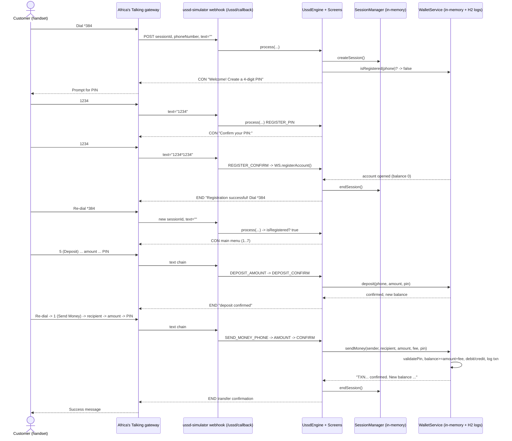

# Test Plan — Customer Onboarding → Successful P2P Transfer

## Workflow chosen & justification

**Workflow: a brand-new customer dials in unregistered, creates a PIN,
funds the wallet, and completes a successful person-to-person money
transfer over USSD.**

This single workflow exercises every cross-cutting concern in the system:
unregistered-number detection and the registration sub-flow, session
establishment and the re-dial boundary, PIN creation and PIN-protected
operations, main-menu routing, multi-step state-machine transitions with
per-screen input validation, the deposit flow (a fresh account starts at
zero balance, so funding is part of "onboarding to a successful
transfer"), tiered fee calculation, balance mutation, transaction
recording, and Africa's Talking webhook contract compliance. If this path
is correct end-to-end, the spine of the product is correct.

> **Behaviour note (verified in source):** registration terminates the
> session with `END`; the customer must **re-dial** to reach the main menu.
> A newly registered account has **balance 0**, so a deposit precedes the
> transfer. There is **no cumulative daily limit** in the codebase — only
> per-transaction minimum/maximum and an available-balance check. Scenarios
> assert current behaviour, not an aspirational daily cap.

## Workflow overview

## Test scenarios

`text` is the cumulative Africa's Talking input chain on `/ussd/callback`
(segments joined by `*`). Service code is `*384#` throughout. "New user"
= a phone number not in the seeded set; "demo user" = `+254700000001`
(PIN `1234`, balance KES 75 000).

45 scenarios. `Pri` = P0 (must pass to ship) / P1 (high value) / P2 (nice to have).

| ID | Scenario | Type | Pri | Preconditions | Steps (USSD input sequence) | Expected outcome |
|---|---|---|---|---|---|---|
| OB-01 | Unregistered dial routes to registration | integration | P0 | New number, no session | dial (`text=""`) | `CON Welcome! Create a 4-digit PIN to register:` |
| OB-02 | Reject invalid new PIN (non-numeric / wrong length) | unit | P0 | At `REGISTER_PIN` | `abcd`, `12`, `123456` | `CON PIN must be exactly 4 digits...` |
| OB-03 | Accept valid new PIN → confirm prompt | integration | P0 | At `REGISTER_PIN` | `1234` | `CON Confirm your PIN:` |
| OB-04 | Confirm mismatch cancels registration | integration | P0 | new_pin set | `1234` then `9999` | `END PINs do not match. Registration cancelled.` |
| OB-05 | Confirm match registers account | integration | P0 | new_pin set | `1234` then `1234` | `END Registration successful!...Dial *384#` |
| OB-06 | Registration terminates session (`END`) | contract | P0 | post OB-05 | inspect response prefix | starts with `END ` |
| OB-07 | Existing number is NOT routed to registration | integration | P1 | demo user | dial as `+254700000001` | main menu, not registration |
| OB-08 | New account starts at zero balance | integration | P0 | post OB-05, re-dial | `4*1234` (check balance) | `END ...KES 0.00` |
| MM-01 | Registered dial shows main menu | integration | P0 | demo user, no session | `text=""` | `CON Welcome to M-Wallet` + options 1–7 |
| MM-02 | Invalid main-menu choice re-prompts | unit | P0 | at `MAIN_MENU` | `9`, `x` | `CON Invalid choice. Try again:` + menu |
| MM-03 | Each option 1–7 routes to its screen | integration | P1 | demo user | `1`..`7` separately | each yields its flow's first prompt |
| DP-01 | Deposit happy path funds the account | integration | P0 | demo user | `5*5000*1234` | `END ...KES 5000 deposited. New balance...` |
| DP-02 | Deposit below minimum rejected | unit | P0 | at `DEPOSIT_AMOUNT` | `5*5` | `CON Minimum deposit is KES 10...` |
| DP-03 | Deposit above maximum rejected | unit | P0 | at `DEPOSIT_AMOUNT` | `5*400000` | `CON Maximum deposit is KES 300,000...` |
| DP-05 | Deposit wrong PIN fails at confirm | integration | P0 | at `DEPOSIT_CONFIRM` | `5*5000*0000` | `END Transaction failed. Wrong PIN entered.` |
| SM-01 | Send money — full happy path | integration | P0 | demo user funded | `1*0700000002*500*1234` | `END TXN... confirmed. KES 500 sent... New balance...` |
| SM-02 | Recipient phone validation rejects garbage | unit | P0 | at `SEND_MONEY_PHONE` | `1*abc` | `CON Invalid phone number. Try again:` |
| SM-03 | Recipient `07…` normalised to `+254…` | unit | P1 | at `SEND_MONEY_PHONE` | `1*0700000002` | proceeds to amount; recipient `+254700000002` |
| SM-04 | Cannot send to self | unit | P0 | sender `+254700000001` | `1*0700000001` | `CON Cannot send to yourself...` |
| SM-05 | Amount below minimum (10) rejected | unit | P0 | at `SEND_MONEY_AMOUNT` | `1*0700000002*5` | `CON Minimum amount is KES 10...` |
| SM-06 | Amount above maximum (500 000) rejected | unit | P0 | at `SEND_MONEY_AMOUNT` | `1*0700000002*600000` | `CON Maximum amount is KES 500,000...` |
| SM-07 | Fee tier boundaries (0/7/13 edges) | unit | P0 | fee calc | amounts 100, 101, 500, 501 | fees 0, 7, 7, 13 respectively |
| SM-09 | Insufficient balance blocks transfer | integration | P0 | new user, balance 0 | register, re-dial, `1*0700000002*500*<pin>` | `END ...Insufficient balance. Available: KES 0.00` |
| SM-10 | Wrong PIN at confirm fails transfer | integration | P0 | demo user | `1*0700000002*500*0000` | `END Transaction failed. Wrong PIN entered.` |
| SM-12 | Balance & ledger updated after success | integration | P0 | demo user funded | SM-01 then `4*1234` | balance −(amount+fee); txn logged |
| WD-01 | Withdraw happy path (flat fee 33) | integration | P0 | demo user | `2*12345*2000*1234` | `END ...KES 2000 withdrawn... Fee: KES 33` |
| WD-02 | Withdraw agent/amount validation | unit | P0 | `WITHDRAW_AGENT`/`AMOUNT` | `2*ab`, `2*12345*20`, `2*12345*200000` | invalid-agent / min-50 / max-150 000 prompts |
| MS-01 | Mini statement with correct PIN | integration | P1 | demo user | `6*5*1234` | `END` mini statement + balance |
| MS-02 | Mini statement / balance wrong PIN | integration | P1 | demo user | `6*5*0000`, `4*0000` | `END ...Wrong PIN entered.` |
| BN-01 | Back-navigation returns to prior screen | unit | P1 | session with screen history | invoke `goBack` from a sub-screen | `currentScreenId` = pushed parent |
| LK-01 | 3 wrong PINs lock the account | security | P0 | demo user | three sessions each `4*0000` | 3rd+ rejected; account locked |
| LK-02 | Locked account rejects valid PIN | security | P0 | post LK-01 within 15 min | `4*1234` | still fails (lockout active) |
| LK-03 | Successful PIN resets attempt counter | security | P1 | 2 wrong then correct | `4*0000`,`4*0000`,`4*1234` | success; counter cleared |
| LK-04 | Lockout is cross-session per phone | security | P0 | wrong PINs across distinct sessionIds | as LK-01 | lockout still triggers |
| SE-01 | Session timeout after 180 s mid-flow | integration | P0 | at `SEND_MONEY_AMOUNT`, idle >180 s | next input | session gone → fresh-dial behaviour |
| SE-02 | Timeout while awaiting PIN entry | integration | P0 | at `*_CONFIRM`, idle >180 s | PIN input | no transfer; session expired |
| SE-03 | Scheduled cleanup evicts expired sessions | integration | P1 | expired session present | wait for `@Scheduled` sweep | active count decremented |
| SE-04 | Max-session cap rejects gracefully | integration | P1 | 10 000 active sessions | create one more | controlled error, no crash |
| SE-05 | Two concurrent sessions, same phone | integration | P1 | demo user | two sessionIds in parallel | independent state, no bleed |
| AT-01 | `CON `/`END ` prefixes correct | contract | P0 | non-terminal & terminal steps | inspect raw body | prefixes match continue flag |
| AT-02 | Response within USSD length limit | contract | P1 | longest screen | measure body length | ≤ ~182 chars or documented |
| AT-03 | Shortcode chain == step-by-step parity | contract | P0 | demo user | `4*1234` one-shot vs stepwise | identical final outcome |
| EX-01 | Invalid input at every menu node | unit | P1 | each screen | out-of-range / garbage input | safe re-prompt, session preserved |
| UI-01 | Browser simulator: full onboarding→transfer | e2e | P1 | live URL, daily-reset state | Playwright drives keypad through workflow | success screen rendered |
| PF-01 | 1 000 concurrent onboarding→transfer sessions | performance | P1 | local/staging | Locust virtual phones | p95 < 200 ms, no OOM, no lost sessions |

## Test data strategy

- **Seeded demo accounts** (`+254700000001`/`1234`, `+254700000002`/`5678`,
  `+254700000003`/`4321`) are the canonical fixtures — restored every start
  and daily at 03:30 UTC. Read-only assertions and the live E2E smoke use
  these.
- **Synthetic new numbers** for registration/onboarding tests are generated
  per test (e.g. `+25470001NNNN`) so each test owns its account; because
  state is in-memory, a fresh Spring context per test class guarantees
  isolation.
- **Unique `sessionId` per scenario** (UUID or test-id prefixed) to prevent
  cross-test session bleed.
- **Boundary data sets** for fee tiers (100/101/500/501/…/≥50 000) and
  amount limits (9/10/500 000/500 001; deposit 10/300 000; withdraw
  50/150 000) are table-driven.
- No production data, no real MSISDNs, no secrets in fixtures.

## Environment strategy

| Environment | Use | Notes |
|---|---|---|
| Local JVM (`mvn verify`) | Unit, integration, contract, mutation | Real engine + real H2; fastest loop, default PR gate |
| Local `docker-compose` | Comprehensive E2E | Mirrors the deployed image |
| Live (`https://ussd.jeffgicharu.com`) | E2E smoke, DAST, performance | Daily 03:30 UTC reset = known baseline; never destructive beyond demo accounts |
| CI (GitHub Actions) | All PR gates | Temurin JDK 17; scheduled jobs for DAST/perf |

## Risk areas

| Risk | Impact | Covered by |
|---|---|---|
| Registration ends session; users may not know to re-dial | UX abandonment / support load | OB-06, OB-07, OB-09 |
| Fresh account has zero balance — first transfer always fails without deposit | Confused onboarding | SM-12, DP-01, OB-09 |
| Fee-tier off-by-one (`<=` boundaries) | Wrong amount debited | SM-08…SM-11 (+ PIT mutation) |
| In-memory session loss on restart / timeout mid-payment | Lost user progress, ambiguous money state | SE-01, SE-02, SE-03 |
| Cross-session PIN brute force (lockout is per-phone) | Account takeover | LK-01…LK-04 |
| Guessable/forgeable `sessionId` → session hijacking | Impersonation | LK-04, SE-05 + security suite (strategy) |
| **Change-PIN does not persist or verify old PIN** (source-confirmed gap) | False sense of security | EX-series + explicit regression once fixed |
| No cumulative daily transfer cap | Unbounded same-day outflow within balance | Documented (out-of-scope below); SM-15 tracks balance integrity |
| Unknown screen id throws at runtime | 500s on malformed state | EX-02 |
| Concurrency on shared `ConcurrentHashMap` wallet state | Lost updates under load | SE-05, PF-01 |

## Out of scope (this plan)

- Withdraw, airtime, loans/savings, change-PIN, language, statements as
  *primary* targets — covered by their own focused plans; only touched here
  where they intersect onboarding→transfer.
- Asserting a cumulative **daily limit** — not implemented in the codebase;
  tracked as a product gap, not a test failure.
- Real Africa's Talking gateway integration (live telco) — the contract
  layer asserts conformance to the documented AT format instead.
- Load beyond the 2 GB VPS envelope; chaos/failover (no HA in this design).
- Penetration testing of the host/nginx/Cloudflare layer.
